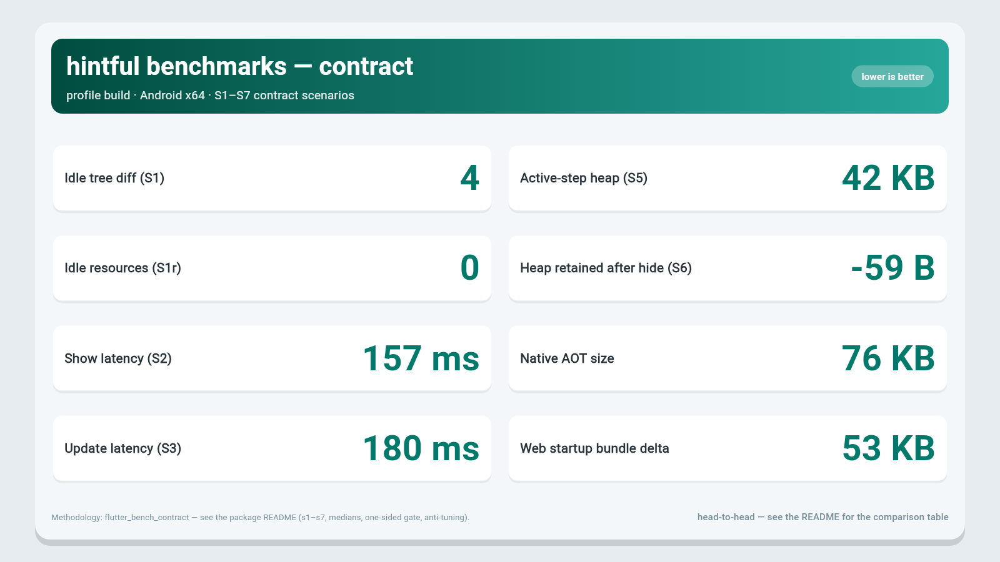

# hintful

[](https://pub.dev/packages/hintful)
[](https://pub.dev/packages/hintful/score)
[](https://github.com/Fellmonkey/hintful/blob/main/LICENSE)
[](https://github.com/Fellmonkey/hintful/actions/workflows/ci.yml)

**Hints & onboarding tours for Flutter.** Spotlight targets, tooltips, coach marks,
guided walkthroughs — a single source of truth for teaching users your product.

You wrap one widget in `HintTarget`, describe what to show in a `HintTour`,
and the engine renders, repositions and remembers it — without a single
hand-written overlay, scroll math or duplicated per-screen styling.

## See it in action

[A hintful tour running over the example app](https://github.com/user-attachments/assets/3a92f95d-2265-4577-954a-63b32b208769)

_Recorded on the `example/` app. Try it live:
[fellmonkey.github.io/hintful](https://fellmonkey.github.io/hintful/)._

## Index

**Start here** — [See it in action](#see-it-in-action) · [Why hintful](#why-hintful) · [What you write](#what-you-write) · [Fast](#fast--measured-not-promised)

**What it does** — [Zero-config, then total control](#zero-config-then-total-control) · [Diagnosis over mystery](#diagnosis-over-mystery) · [Accessibility](#accessibility-on-by-default) · [Works anywhere](#works-anywhere) · [Features](#features) · [Server-driven tours](#server-driven-tours)

**Install & docs** — [Getting started](#getting-started) · [Documentation](#documentation) · [best practices](doc/best_practices.md#index) · [FAQ](doc/faq.md) · [Performance](#performance)

---

## Why hintful

Every Flutter hint/tour library you've seen is built on the same two ideas:
`GlobalKey` + a full-screen `OverlayEntry` that the library manually positions,
scrolls and lays out. That is exactly where tours break: the tooltip drifts a
pixel off or covers the control it points at, the overlay goes off-screen
mid-scroll and dies with `This widget has been unmounted`, and on a first run it
silently gives up because the target isn't built yet.

`hintful` throws that model away.

### What's different

| Old way (`GlobalKey` + overlay) | `hintful` |
|---|---|
| Manual position / scroll / re-layout | **CompositedTransform** — tooltip and scrim follow the target every frame, zero scroll math, overflow impossible |
| References to widget contexts | **Registry by id** — `HintTarget(id: 'filters')` registers/unregisters itself; nothing to unmount |
| "Wait until the widget is built" by hand | **Wait-for-target** — a tour waits for a deferred target instead of dying |
| Per-hint hard-coded styling | **ThemeExtension** — hint inherits your design system, light and dark, from `Theme.of` |
| Tied to Bloc/Riverpod/… | **Framework-agnostic core** — vanilla `ValueListenable<HintState>`, no state-management imports |
| Overlay mounted even when idle | **Zero-idle cost** — zero engine widgets in the tree until a tour actually starts |

_Zero-idle is about the engine: no overlay, entry or listener exists until a tour
starts. The thin `HintTarget` wrapper around your widget is the only idle
footprint — that's the `4` nodes in the S1 row of the benchmark table below._

## What you write

```dart
// 1. Wrap the thing you want to explain
HintTarget(
  id: 'exerciseSelector',
  child: ExerciseSelector(),
)
// ...or the one-liner sugar: ExerciseSelector().withHint('exerciseSelector')

// 2. Declare the tour — data, not widgets
final introTour = HintTour(
  id: 'intro',
  steps: [
    HintStep(
      targetId: 'exerciseSelector',
      title: 'Pick a movement',
      description: 'Filter by muscle, equipment or name.',
    ),
    HintStep(
      targetId: 'addSet',
      title: 'Log your set',
      description: 'Weight × reps, one tap.',
    ),
  ],
);

// 3. Wire once, show once
final controller = HintController(
  overlayHostBuilder: defaultOverlayHost(),
);
controller.start(introTour);
```

No `GlobalKey`, no `OverlayEntry`, no `ScrollController`, no manual position.
That's the whole tour — and it already handles light/dark, scrolling and
deferred targets.

Localizing? Swap `title`/`description` for `titleBuilder`/`descriptionBuilder`
(`(c) => AppLocalizations.of(c)!.introTitle`): the copy stays in your `AppTours`
file and the `BuildContext` arrives from the overlay.

```dart
// Just one tip? No tour needed:
controller.showHint(
  HintStep(targetId: 'addSet', title: 'Swipe left to delete a set'),
);
```

## Fast — measured, not promised

One scene, three libraries, profile Android emulator — recorded by CI into
`benchmark/benchmarks.json`, rendered straight from that file into the table
below — one source of truth for every number. Table, charts, methodology:
[Performance](#performance).

## Zero-config, then total control

Out of the box, `title`/`description` steps render in a default tooltip under
a default theme — the tour above is already complete. When you need more, the
API grows rung by rung, each optional: `HintTheme` styles → `HintTooltipLabels`
(button texts, waiting placeholder, screen-reader announcements) →
`titleBuilder`/`descriptionBuilder` for l10n → a fully
custom tooltip through `tooltipBuilder`. Your design system, your call.

## Diagnosis over mystery

When a hint doesn't show, you'll know why in one log line:

```
[hintful] statsIntro step 2 not shown: timeout (target 'statsPeriodSelector') — target 'statsPeriodSelector' did not appear within 0:00:03.000000
```

Not "it just didn't appear." If you typo a `targetId`, `hintful` tells you loudly in
debug — with the closest candidates.

The reasons and their fixes: [FAQ §1](doc/faq.md#1-my-hint-didnt-show--why);
wiring your own handler for analytics:
[best practices §12](doc/best_practices.md#12-diagnostics--trust-the-log).

## Accessibility, on by default

- **Screen readers**: every step is announced as "Step N of M: <title>".
- **Keyboard**: Tab/Shift+Tab move forward/back, Enter = next, Esc = skip;
  the tour manages focus and returns it to the element you were on before
  it started.
- **Reduce motion**: with the system setting on, transitions are instant.
- **Text scale**: the tooltip fits on screen at 2× text scale (content
  scrolls instead of overflowing) — writing copy that never needs it:
  [FAQ §5](doc/faq.md#5-text-overflows-at-20-scale).
- **Contrast**: the default theme meets WCAG AA (4.5:1) for text and
  buttons, in light and dark — asserted across brightness and colour seeds
  in the theme tests.
- **Targets**: `HintTarget(semanticsLabel: ...)` labels the spotlighted
  widget itself for the screen reader — so an icon-only button is not
  announced as a blank.

## Works anywhere

The state/data core is framework-agnostic by construction — `controller`,
`machine`, `registry`, `specs`, `store` and `diagnostics` import only
`dart:ui`/`flutter/foundation`/`flutter/widgets`, and nothing
state-management related. (Render mechanics and `HintTheme` are built on
`material` — that is where `ColorScheme` and the dialog come from.) Vanilla
Flutter works out of the box via `ValueListenableBuilder` — zero
dependencies. Bloc/Riverpod/Provider/GetX wiring ships as copy-paste recipes
in `lib/src/adapters/` (bring your own package).

And it is testable headless: `HintController(overlayHostBuilder: null)` runs
the whole machine — wait-for-target, timeouts, typo validation, diagnostics —
with no overlay at all, which is how the tour flow tests drive it
(`test/helpers/tour_harness.dart`). Headless vs full-fidelity, and the
two-frame rule: [best practices §20](doc/best_practices.md#20-testing--headless-first).

## Features

**Tour control**

- `start/next/previous/goTo/skip/finish`; safe variants
  `tryStart/restart/tryShowHint` + `isIdle` — no manual guards before starting
- Wait-for-target for deferred and lazy-loaded widgets, with timeout + diagnosis
- Missing targets: `HintMissingTargetPolicy.skipStep` (tour default or per-step)
  skips an absent target with a `timeout` diagnosis and continues the tour;
  short/`Duration.zero` `waitTimeout` for conditionally-absent targets
- Scoped controllers: `scopePrefix` isolates tabs/split-view sharing one
  registry (foreign ids neither activate steps nor false-fire typo candidates)
- `disableBackButton` owns the Android back button while a tour is active;
  Skip auto-hides on the last step of a multi-step tour (Done does the
  same); a single-step hint keeps no action row at all

**Rendering**

- CompositedTransform tooltip + scrim — follows scroll/layout/animation for free
- Smart positioning: auto-flip to the side with room, keep-in-safe-area,
  and a tail (arrow) tying the tooltip to its target — a hint never lands
  half off-screen or on top of the control it points at
- Multi-target steps: several elements spotlighted at once, the tooltip
  avoiding the other spotlighted targets
- Multi-content: several tooltips around one target, guaranteed not to
  overlap each other or the targets
- Optional blur scrim and pulsing ring (theme options; the default stays a
  plain dim — the lightest thing to render)
- Focus shapes (rectangle/circle/rounded) + padding (including negative
  shrink), static rect spotlights (`targetRect` — no widget needed), and
  scroll-into-view: an offscreen target is brought on screen with its step
- Entry animation in three rungs: none by default; the `easeOut` quiet fade
  (200 ms) or the `sprung` bounce (800 ms) per step via `transitionCurve`
  (+ `transitionDuration`); anything custom through `tooltipBuilder` (the
  engine still places it) — all skipped under the system reduce-motion
  setting, and `hintTransitionDuration` is the shared helper for your own
  animation
- Tap regions: tap-on-target vs tap-on-overlay with per-step callbacks and
  tap position; scroll-through — the page scrolls under an active tour

**Content & reuse**

- Enum-typed tours: `HintTour.fromEnum` — the exhaustive `stepFor` switch
  makes adding/removing a step a compile error
- Versioned hints (`HintStore`): show once per app version —
  `shouldShow(key, minVersion:)` before start, `markShown` on exit
- "Want a tour?" pre-dialog (`showHintTourOffer`, own `HintTourOfferLabels`):
  declines persist per page or globally, the tour stays reachable from other
  entry points
- `withHint` sugar (`child.withHint('id')`) and target-level
  `focusShape`/`focusPadding` — the shape lives on the widget, a step
  overrides only the exception
- Per-step lifecycle hooks: `onBeforeAction`/`onAfterAction` (async) around a
  step — analytics and app reactions

Every rule behind the bullets above — what to do, what not to, and why — lives
in [best practices](doc/best_practices.md#index), one decision per section:
targets and shape (§1), `isIdle` vs `tryStart` (§5), versions (§6), multi-target
and multi-content (§14–15), taps (§16), motion (§17), navigation (§18),
server-driven tours (§19), testing (§20).

## Server-driven tours

No extra dependency — `HintTour.fromJson/toJson` + `FetcherHintTourFactory` (bring your own `http`/`dio`):
```dart
final factory = FetcherHintTourFactory(
  baseUrl: 'https://cdn.example.com/tours',
  fetcher: (uri) async => (await http.get(uri)).body, // your client
);
final tour = await factory.fetch('onboarding');
await controller.start(tour);
```

The wire format carries copy, order, timing and layout of **known** targets —
builders and callbacks stay in code, so a server cannot introduce a target that
isn't in the shipped build. Payload rules, validation and the offline fallback:
[best practices §19](doc/best_practices.md#19-server-driven-tours--what-json-can-and-cannot-carry).

## Getting started

Add to your `pubspec.yaml`:

```yaml
dependencies:
  hintful: ^0.7.0
```

```dart
import 'package:hintful/hintful.dart';
```

Requires Dart ≥ 3.0 / Flutter ≥ 3.10 — that floor comes from three things
hintful leans on: sealed machine states, `CompositedTransform` +
`LayerLink.leaderSize`, and `ThemeExtension`.

See `example/` for working demos of every feature above — shaped holes,
blur/pulse styles, custom animated tooltips, JSON tours, tap regions, the  offer dialog, and the versioned intro.

## Documentation

- [`doc/best_practices.md`](doc/best_practices.md#index) — the decisions that keep
  tours findable and hard to break, one per section, with the code to copy;
- [`doc/faq.md`](doc/faq.md) — "my hint didn't show", `GlobalKey`, `tryStart`,
  `targetRect` without a target, text scale, taps, multi-target vs
  multi-content, testing, server-driven tours and the offer dialog;
- [`CHANGELOG.md`](CHANGELOG.md) — what changed across 0.x;
- [`benchmark/README.md`](benchmark/README.md) — how the numbers under
  [Performance](#performance) are recorded.

MIT licensed.

---

<!-- bench:start -->
## Performance

One scene, three solutions: the contract scenarios S1–S6 on a profile Android emulator plus the host size builds (S7). Values are the recorded goldens in `benchmarks.json` (refs `android` / `android-scv` / `android-tcm`). Methodology: `benchmark/README.md`; `benchmark/compare` hosts the rival drivers.

| Metric | hintful | showcaseview | tutorial_coach_mark |
|---|---|---|---|
| Idle tree diff (S1) | 4 | 2 | 3 |
| Idle resources (S1r) | 0 | 0 | 0 |
| Show latency (S2) | 157 ms | 181 ms | 885 ms |
| Update latency (S3) | 180 ms | 312 ms | 1441 ms |
| Active-step heap (S5) | 42 KB | 65 KB | 94 KB |
| Heap retained after hide (S6) | -59 B | -325 B | -91 B |
| Native AOT size | 76 KB | n/a | n/a |
| Web startup bundle delta | 53 KB | n/a | n/a |

**n/a** = not applicable for this solution. Scroll coupling (S4) is a two-sided in-scenario assert, not a numeric row: hintful re-anchors its content to the target under programmatic scroll on-device, while showcaseview and tutorial_coach_mark do not (their overlays consume pointer input). The idle-resources row (S1r) is declared on-device via `idleClasses` — 0 means the solution holds no live control-plane instances while idle. The size rows are hintful-only because the rival scenes were never shipped as size targets.

**Trend history:** [charts](https://fellmonkey.github.io/hintful/bench/)



_Recorded 2026-09-12 19:42 UTC. Regenerate: dispatch the `bench-record` workflow with `record`._
<!-- bench:end -->

